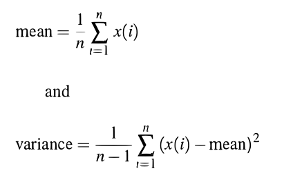

# Fortran excersises

Exercises marked with a * should be turned in.

Complete the assignments 1-11 to 1-22 in the getting started guide.

Do the mixed language exercise X.3*

## M.1*. Write a program which

 1. Defines an array to have 100 elements;
 1. assigns to the elements the values 1,2,3, ..., 100;
 1. reads two integer values in the range 1 to 100;
 1. reverses the order of the elements of the array in the range specified by the two values.

## M.2*. Evaluating expressions 

Write a program which reads a value, x, and calculates and prints the corresponding value x/(1.+x). The case x=-1 shoud produce an error message and be followed by an attempt to read a new value of x.

## M.3*. Mean and variance again 

Write a subroutine that receives as an argument an array of values, x, and the number of elements in x, n. If the mean and variance of the values in x are estimated by

Write a subroutine which returns these calculated values as arguments. The subroutine check for invalid values of n (<=1).

## X.3* Mean and variance using numpy and F2PY

Implement M.3 as a Fortran-module that can be called from Python. Use F2PY to create a python extension module.

## M.4. Array operations

    real, dimension(50,20) :: a

write array sections representing

 1. the first row of a;
 1. the last column of a;
 1. every second element in each row and column;
 1. as for (iii) in reverse order in both dimensions;
 1. a zero-sized array

## M.5. Where-statement

Write a where statement to double the value of all the positive elements of an array z.

## M.6. Array syntax

Complete excercise M.1 using array syntax instead of do constructs.

## Extra Material

## E.1 Derived datatypes

Create a derived data type for a particle in a particle system.

The particle should have the following attributes:

    position
    velocity
    mass

Create an allocatable array with 1000 particles.

Initialise all particles with the position (0,0,0) and a random velocity and a mass of 1.0

## E.2 Derived datatypes and overloading

Implement a derived datatype for a vector and use operator overloading to implement common vector operations such as adding, subtracting and multiplication (cross-product).

