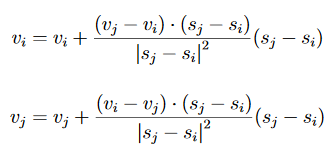
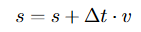

# Simulation of particles in a box

This exercise is adapted from the Uppsala course ”Programmeringsteknik MN2 vt01”

We are to construct a program that simulates a number of particles moving in a box. Such a system can be used to simulate e.g.  a gas in a closed container.

The particles are confined to a unit box with the lower left corner at (0,0) and the upper
right corner at (1,1). Particles sizes are set to random values between 0.005 and 0.015 and given an initial velocity of *v0* = 0.01.

Each particle have a position, *s* a speed *v* and a radius *r*.

Initially all particles are randomly positioned in the box.  Each particle have the same speed but moving in different directions. The speed vector can be computed as (v0*cos(alfa), v0*sin(alfa)), where *alfa* is a random number in [0,2*pi]. 

The particles moves the distance ∆t in each timestep according the following criterias.

 1. Decide  whether  any  particle  collides  with  a  wall  in  the  box  (this  means  that  the distance from the border to the particle is less than the radius).  If a collision occurs the particle should bounce.
 1. Decide whether two particles collide. If particle i och j collide, use the formula: 
 
    

    to update their speed.  (The operation denotes dot product) Ignore the case where more than two particles collide.

1. When all particles have been tested, they move to a new position using the formula:

    

The time step At should be selected so that the particles don’t pass through the walls.  A suitable value is ∆t=r/(3*v0). Input to the simulation is the number of particles, initial speed and radius.

# Task 1 - Fortran implementation

The implemented Fortran application should use modules for it’s implementation.  Divide the application in logical modules:

 * app_defs
   * Definition of constants that will be used throughout the application.  Constants for selected_real_kind() and selected_int_kind() could be put in this module.
 * app_data
   * Could contain data structures and arrays used in the application.  Routines for initialising, reading/writing and destruction of data could also be located in this module.
 * app_sim
   * This module contains the actual routines that handles the actual simulation.
 * app_utils
   * Utility routines that are used throughout the application.
 * vector_operations
   * Module not specific to the application, but contains generic reusable code.
   
The app-prefix is just a suggestion. Replace this with something that is more suitable for your application.

Use CMake to handle makefile generation.  A sample CMakeLists.txt file is shown below:

    cmake_minimum_required(VERSION  3.0)
    
    project(particles)
    enable_language(Fortran)
    add_executable(particles main.f90 
       app_defs.f90  app_utils.f90 app_data.f90  
       app_sim.f90  vector_operations.f90)

To  aid  the  debugging  of  the  Fortran  code  a  special  Python-script  is  provided,  particle_player.py, which can be downloaded from the course page.  This script reads particle sizes and positions from a text file and displays a visualisation of the movement of particles.  The file format used is described below:

    [number of particles n]
    [particle size 1]
    .
    .
    .
    [particle size n]
    [Number of particles, n, for timestep 1]
    [x1] [y1]
    .
    .
    .
    [xn] [yn]
    [Number of particles, n, for timestep 2]
    [x1] [y1]
    .
    .
    .
    [xn] [yn]
    [Number of particles, n, for timestep m]
    [x1] [y1]
    .
    .
    .
    [xn] [yn]

# Task 2 - Create a F2PY interface for the Fortran code

In this task the previous Fortran application will be given a Python interface using the F2PY  tools.   To  make  it  easier  to  use  the  F2PY  tool,  a  special  Fortran  module  will be implemented that represents the interface to Python.  This module should typically contain subroutines for driving the simulations (check_collision,update_positions etc).

To make it easier to wrap the Fortran code, only the interface module will by converted by the F2PY converter.  Other code will be compiled as a library separately and linked into to the Python module from the F2PY command.  A library can be compiled with CMake by adding the following to the existing CMakeList.txt file:

    add_library(applib SHARED app_defs.f90  app_utils.f90  
        app_data.f90 app_sim.f90  vector_operations.f90)

The python module can then be built using the following command: 

    f2py -m app -c app_interface.f90 -I./ build -L./ build -lapplib

When  the  extension  module  has  been  built,  implement  a  python  based  main  program that drives the simulation.

# Task 3 Create a simple user interface

Use PyQt5 to create a simple user inteface for controlling input parameters sucha as number of particles and the number of iterations.
    